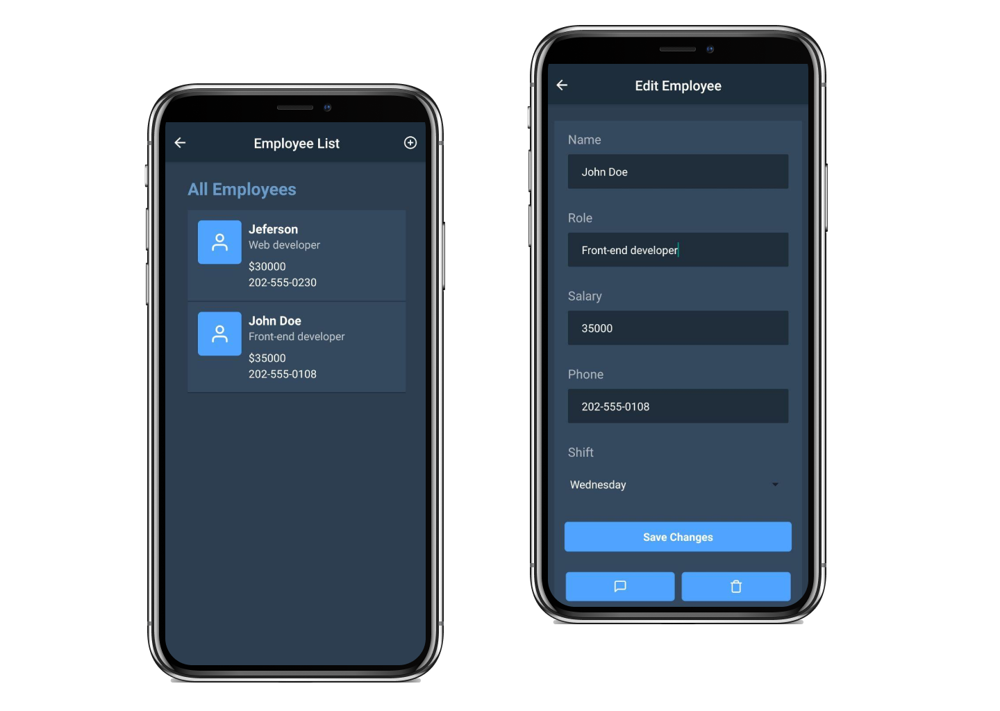

# Manager App

Simple app for managing employees on a business built using React Native, Redux and Firebase



<div align="center">


</div>

### 📱 Demo

[Download for Android](https://github.com/jeferson-sb/manager-app/releases/tag/1.0.0)

## 🚀 Quick start

### Installation

```bash
$ cd manager-app
$ yarn
```

### Usage

```bash
$ cd manager-app
$ yarn start
```

## To-Do

- [ ] Create meetings
- [ ] Create tasks for employees

## 📝 License

This project is licensed under the terms of the [MIT](https://github.com/jeferson-sb/manager-app/blob/master/LICENSE) license

> Made with ♥ by Jeferson © 2020
